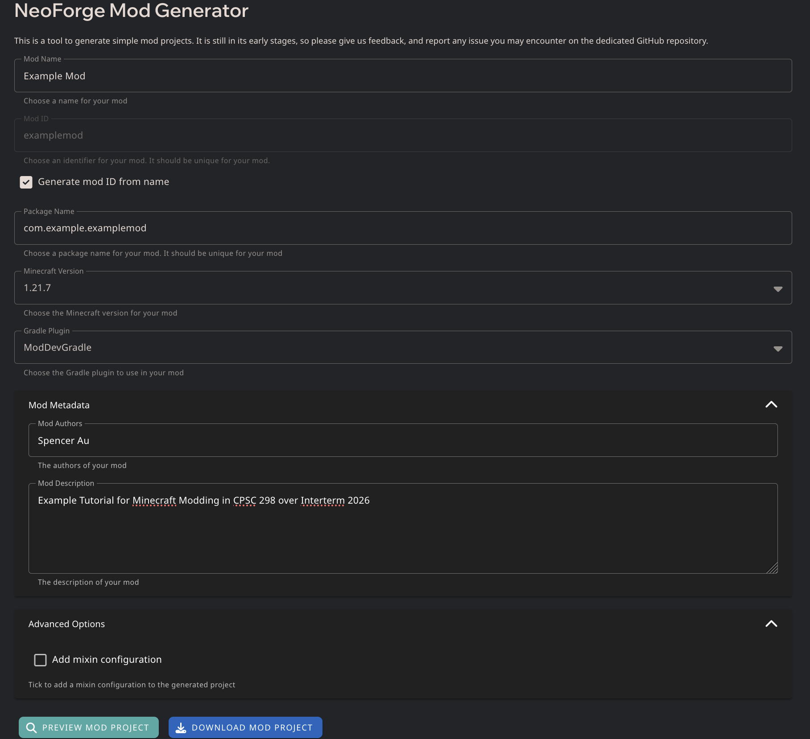
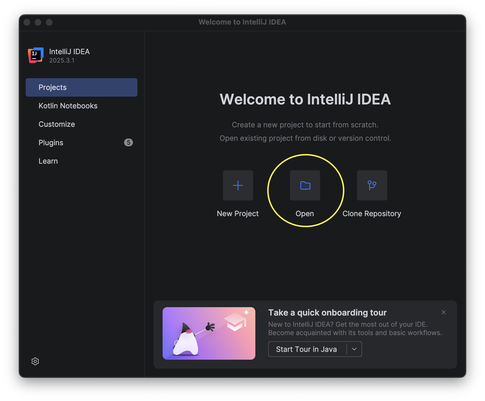
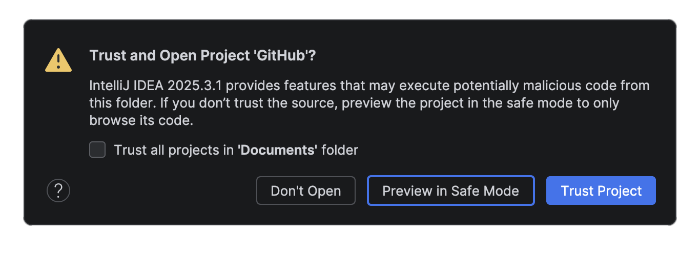
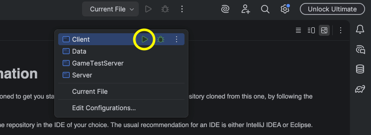

# Setup Instructions

## Installing Java

TODO (prob brew or whatever the windows non cli equivalent is)

------------------------------------------------------------------------------------

## Installing IntelliJ IDEA

Click on [this link](https://www.jetbrains.com/idea/download/) to install IntelliJ.

Download the appropriate installer for your device

  - Windows: exe installer

  - MacOS: dmg installer

and run the installer and follow the directions to install IntelliJ IDEA

------------------------------------------------------------------------------------

## Creating a NeoForge Mod

Use the [NeoForge Mod Generator](https://neoforged.net/mod-generator/) to create a template mod that you will import into IntelliJ.  

We will be using **Minecraft/NeoForge version 1.21.7** and the **ModDevGradle Plugin**

If you wish to follow the same project and directory naming conventions as Jon, then:
  - set Mod Name: **Example Mod**
  - enable **Generate mod id from name**
  - set Package Name: **com.example.examplemod**

Under Mod Metadata, you can put your name and a description if you wish. 

 

All in all, if you are using the "default" settings, it should look like this:

   

Then click *Download Mod Project* to download a zip of the NeoForge Mod. Unzip the generated mod file, and place it *somewhere*. For example, on MacOS, I renamed the folder to `cpsc298-minecraft-examplemod` and store it within `/Users/spencerau/Documents/GitHub`.

------------------------------------------------------------------------------------

## Importing the Gradle Project

Open up IntelliJ, and open up the unzipped mod project you have generated from NeoForge. Following the earlier example, the generated mod folder is at `/Users/spencerau/Documents/GitHub/cpsc298-minecraft-examplemod`, but obviously your own mod folder name and location will differ.

   

InteliJ will prompt you to *Trust and Open* the Project. Click *Trust Project* and it will open up the project.

   

------------------------------------------------------------------------------------

## Building and Running

Navigate to the top middle of the screen, and find the menu options that say **Current File**. From here, we want to open the menu, navigate to **Client**, and click on the corresponding green *play* button in order to build and run the Gradle project. IntelliJ makes this fairly simple as you just need to click the button to do all this.

   

<!-- - Open up a command line interface by clicking on this icon on the bottom left of IntelliJ:

   

- Set Gradle permissions with `chmod +x gradlew`.
 

- Run `./gradlew build` to build the project, and then run `./gradlew runClient` to actually start up Minecraft and test your mod.
  -->

If it builds properly, and launches Minecraft and lets you play, then congratulations, you have set it up correctly!

Everything should be working for you to start modding now. IntelliJ makes this fairly simple as you just need to click the button to do all this.