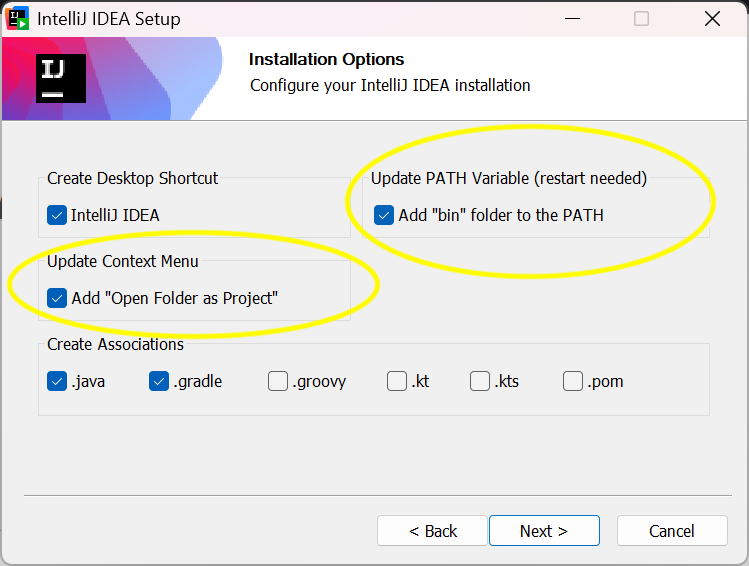
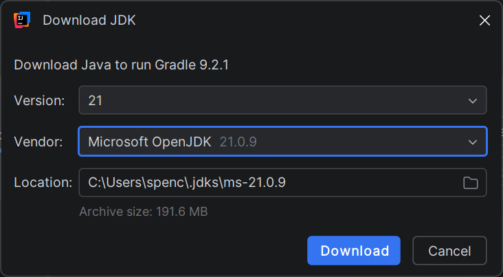
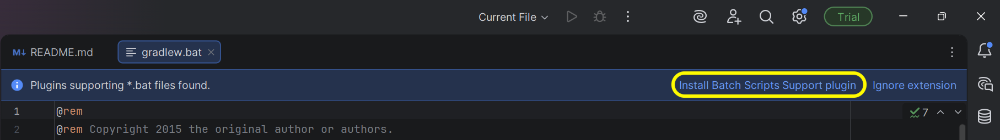
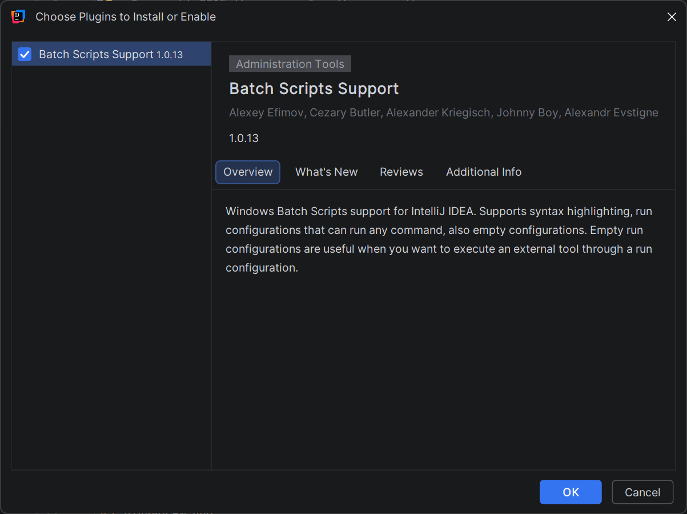
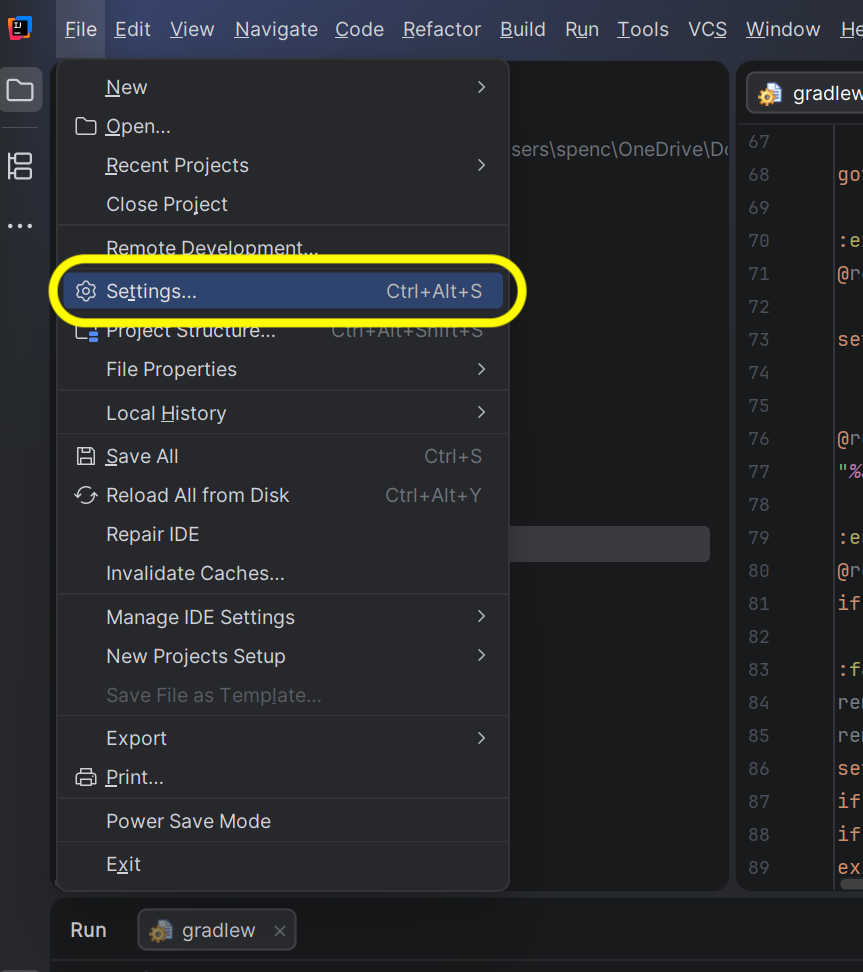
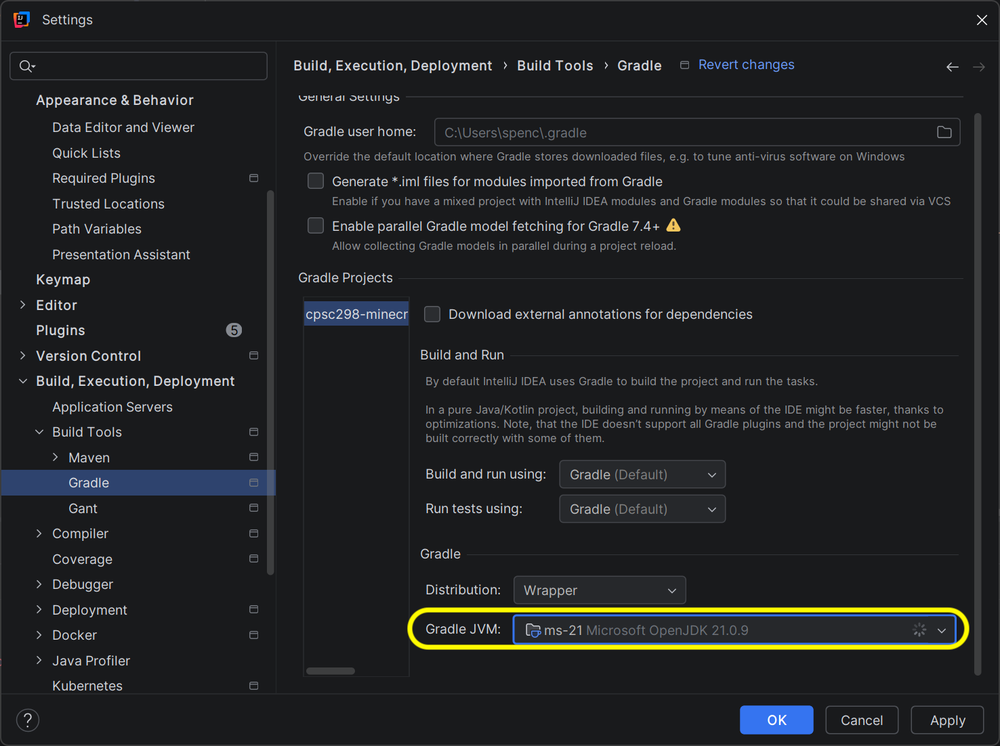
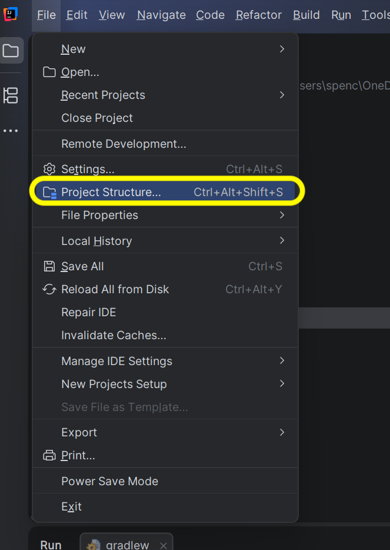
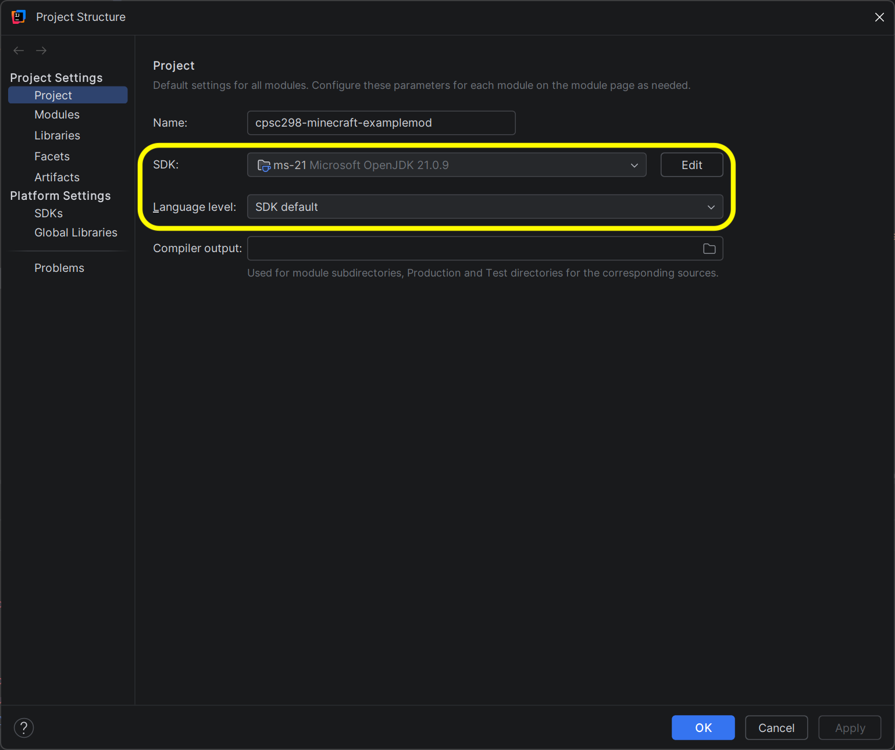
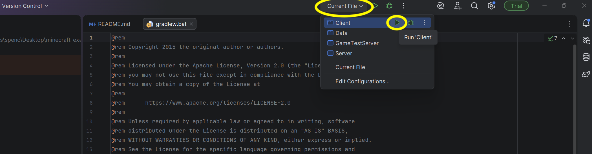

# Setup Instructions

## Installing IntelliJ IDEA

Click on [this link](https://www.jetbrains.com/idea/download/) to install IntelliJ. 

Download the appropriate installer for your device

  - Windows: exe installer

  - MacOS: dmg installer

and run the installer and follow the directions to install IntelliJ IDEA

When installing on Windows, you will need to make sure to select both **Update Context Menu** and **Update PATH Variable**

   

## Creating a NeoForge Mod

Use the [NeoForge Mod Generator](https://neoforged.net/mod-generator/) to create a template mod that you will import into IntelliJ.  

We will be using **Minecraft/NeoForge version 1.21.7** and the **ModDevGradle Plugin**

If you wish to follow the same project and directory naming conventions as Jon, then:
  - set Mod Name: **Example Mod**
  - enable **Generate mod id from name**
  - set Package Name: **com.example.examplemod**

Under Mod Metadata, you can put your name and a description if you wish. 

 

All in all, if you are using the "default" settings, it should look like this:

   

Then click *Download Mod Project* to download a zip of the NeoForge Mod. Unzip the generated mod file, and place it *somewhere*. For example, on MacOS, I renamed the folder to `cpsc298-minecraft-examplemod` and store it within `/Users/spencerau/Documents/GitHub`.

## Importing the Gradle Project

Open up IntelliJ, and open up the unzipped mod project you have generated from NeoForge. Following the earlier example, the generated mod folder is at `/Users/spencerau/Documents/GitHub/cpsc298-minecraft-examplemod`, but obviously your own mod folder name and location will differ.

   

InteliJ will prompt you to *Trust and Open* the Project. Click *Trust Project* and it will open up the project.

   

## Installing Java

You may be prompted to install Java by IntelliJ in order to run Gradle. NeoForge will want **JDK 21**, so make sure to select that.

   

In addition, you may need to install extensions to support .bat files in IntelliJ. Click on the `gradlew.bat` file, and you should get this prompt. Click on **Install Batch Scripts Support plugin**

   

Which should pull up the install for the Batch Scripts Support Plugin. Install that in order to execute .bat files in IntelliJ.

   

Just to confirm that Gradle and IntelliJ are using the correct versions of JDK, we want to navigate to both **Settings** and **Project Structure**.

### IntelliJ Settings

Navigate to the file menu by clicking on the triple bars on the top left, and select **Settings**

   

Navigate to **Build, Execution, Deployment**, then to **Build Tools**, and then to **Gradle**. From here, make sure that **Gradle JVM** has the correct selected version of Java for your mod project.

   

### IntelliJ Project Structure

Navigate to the file menu by clicking on the triple bars on the top left, and select **Project Structure**

   

We want to check that both the **SDK** and **Language level** settings are pointing to the correct version of Java. 

   

## Building and Running

To build and run, navigate to the top middle of the screen, and find the menu options that say **Current File**. From here, we want to open the menu, navigate to **Client**, and click on the corresponding green *play* button in order to build and run the Gradle project. IntelliJ makes this fairly simple as you just need to click the button to do all this.

   

If it builds properly, and launches Minecraft and lets you play, then congratulations, you have set it up correctly!